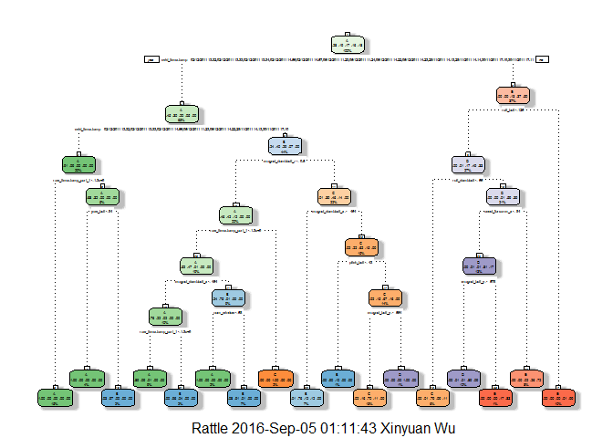

# Practical Machine Learning Course Project
Xinyuan Wu  
September 4, 2016  


## Summary

Using devices such as Jawbone Up, Nike FuelBand, and Fitbit it is now possible to collect a large amount of data about personal activity relatively inexpensively. In this project, six participants were asked to perform barbell lifts correctly and incorrectly in 5 different ways. Our goal is to use data from accelerometers on the belt, forearm, arm, and dumbell of 6 participants to build a machine learning method that can be used to predict the type of activities.

Three different tree-based models are tested. Based on prediction accuracy on the validation data set, random forest is selected as the final model to be applied to the testing set.

## Data Processing

In this section, we are going to summarize the data processing procedure prior to model building. By looking at the data, we decided to treat both "NA" and "#DIV/0!" as NA value.

```r
library(caret)
library(rattle)
library(rpart)
library(randomForest)
train <- read.csv("pml-training.csv", na.strings=c("NA","#DIV/0!",""))
testing <- read.csv("pml-testing.csv", na.strings=c("NA","#DIV/0!",""))
```

After loading the data, we create a validation set that can be used to estimate the out-of-sample error rate.

```r
# create the validation set
set.seed(1314)
inTrain <- createDataPartition(y = train$classe, p=0.7, list = FALSE)
training <- train[inTrain, ]
validation <- train[-inTrain, ]
dim(training); dim(validation); dim(testing)
```

```
## [1] 13737   160
```

```
## [1] 5885  160
```

```
## [1]  20 160
```

Then we need to decide which variables should be included in the prediction. First, we check and remove near zero variables using nearZeroVar function.

```r
# remove near-zero variables
nzv <- nearZeroVar(training,saveMetrics=TRUE)$nzv
training <- training[, !nzv]
validation <- validation[, !nzv]
testing <- testing[, !nzv]
```

Second, we need to deal with NA values.

```r
NAv <- sapply(training, function(x) sum(is.na(x)))
unique(NAv)
```

```
##  [1]     0 13466 13477 13465 13457 13508 13509 13507 13460 13459 13458
## [12] 13517 13518 13516
```

It can be seen that in this data set, a column is either having zero missing values or is containing many missing values. Therefore, we remove the columns that has missing values.

```r
training <- training[, NAv == 0]
validation <- validation[, NAv == 0]
testing <- testing[, NAv == 0]
```

Finally, the first column contains only observation number, so it can be removed from all three data sets.

```r
training <- training[, -1]
validation <- validation[, -1]
# the last column of testing contains useless information as well
testing <- testing[, -c(1, 59)]
# transform the data into the same data type
testing <- rbind(training[, -58], testing)
testing <- tail(testing, n = 20)
dim(training); dim(validation); dim(testing)
```

```
## [1] 13737    58
```

```
## [1] 5885   58
```

```
## [1] 20 57
```

The final tidy data contains 58 variables, including 1 outcome variable.

## Model Selection

Since the outcome is a factor that contains 5 possibilities, linear regression model may not be a good choice, so we decided to try three different tree models.

### Decision Trees


```r
set.seed(1314)
Modrpart <- rpart(classe ~ ., data = training)
rpartPred <- predict(Modrpart, validation, type = "class")
confusionMatrix(rpartPred, validation$classe)
```

```
## Confusion Matrix and Statistics
## 
##           Reference
## Prediction    A    B    C    D    E
##          A 1615   49    5    4    0
##          B   46  934   58   43    0
##          C   13  146  946   90   56
##          D    0   10   10  665   54
##          E    0    0    7  162  972
## 
## Overall Statistics
##                                           
##                Accuracy : 0.872           
##                  95% CI : (0.8632, 0.8805)
##     No Information Rate : 0.2845          
##     P-Value [Acc > NIR] : < 2.2e-16       
##                                           
##                   Kappa : 0.8381          
##  Mcnemar's Test P-Value : NA              
## 
## Statistics by Class:
## 
##                      Class: A Class: B Class: C Class: D Class: E
## Sensitivity            0.9648   0.8200   0.9220   0.6898   0.8983
## Specificity            0.9862   0.9690   0.9372   0.9850   0.9648
## Pos Pred Value         0.9653   0.8640   0.7562   0.8999   0.8519
## Neg Pred Value         0.9860   0.9573   0.9827   0.9419   0.9768
## Prevalence             0.2845   0.1935   0.1743   0.1638   0.1839
## Detection Rate         0.2744   0.1587   0.1607   0.1130   0.1652
## Detection Prevalence   0.2843   0.1837   0.2126   0.1256   0.1939
## Balanced Accuracy      0.9755   0.8945   0.9296   0.8374   0.9316
```

```r
fancyRpartPlot(Modrpart)
```

<!-- -->

Single decision tree saves a lot of computation, but having an accuracy of 0.872 is not good enough for our prediction.

### Boosting with Trees


```r
set.seed(1314)
ctrl <- trainControl(method = "repeatedcv", number = 3, repeats = 1)
Modgbm <- train(classe ~ ., method = "gbm", data = training, 
			trControl = ctrl, verbose = FALSE)
gbmPred <- predict(Modgbm, newdata = validation)
confusionMatrix(gbmPred, validation$classe)
```

```
## Confusion Matrix and Statistics
## 
##           Reference
## Prediction    A    B    C    D    E
##          A 1673    1    0    0    0
##          B    1 1138    1    0    0
##          C    0    0 1019    1    0
##          D    0    0    6  960    2
##          E    0    0    0    3 1080
## 
## Overall Statistics
##                                           
##                Accuracy : 0.9975          
##                  95% CI : (0.9958, 0.9986)
##     No Information Rate : 0.2845          
##     P-Value [Acc > NIR] : < 2.2e-16       
##                                           
##                   Kappa : 0.9968          
##  Mcnemar's Test P-Value : NA              
## 
## Statistics by Class:
## 
##                      Class: A Class: B Class: C Class: D Class: E
## Sensitivity            0.9994   0.9991   0.9932   0.9959   0.9982
## Specificity            0.9998   0.9996   0.9998   0.9984   0.9994
## Pos Pred Value         0.9994   0.9982   0.9990   0.9917   0.9972
## Neg Pred Value         0.9998   0.9998   0.9986   0.9992   0.9996
## Prevalence             0.2845   0.1935   0.1743   0.1638   0.1839
## Detection Rate         0.2843   0.1934   0.1732   0.1631   0.1835
## Detection Prevalence   0.2845   0.1937   0.1733   0.1645   0.1840
## Balanced Accuracy      0.9996   0.9994   0.9965   0.9971   0.9988
```

This method is significantly slower than the single decision tree, but it has much higher accuracy (0.9975).

### Random Forest


```r
set.seed(1314)
# much faster than train function with "rf" method as argument
Modrf <- randomForest(classe ~ ., data = training)
rfPred <- predict(Modrf, newdata = validation)
confusionMatrix(rfPred, validation$classe)
```

```
## Confusion Matrix and Statistics
## 
##           Reference
## Prediction    A    B    C    D    E
##          A 1672    1    0    0    0
##          B    2 1138    1    0    0
##          C    0    0 1023    2    0
##          D    0    0    2  960    1
##          E    0    0    0    2 1081
## 
## Overall Statistics
##                                           
##                Accuracy : 0.9981          
##                  95% CI : (0.9967, 0.9991)
##     No Information Rate : 0.2845          
##     P-Value [Acc > NIR] : < 2.2e-16       
##                                           
##                   Kappa : 0.9976          
##  Mcnemar's Test P-Value : NA              
## 
## Statistics by Class:
## 
##                      Class: A Class: B Class: C Class: D Class: E
## Sensitivity            0.9988   0.9991   0.9971   0.9959   0.9991
## Specificity            0.9998   0.9994   0.9996   0.9994   0.9996
## Pos Pred Value         0.9994   0.9974   0.9980   0.9969   0.9982
## Neg Pred Value         0.9995   0.9998   0.9994   0.9992   0.9998
## Prevalence             0.2845   0.1935   0.1743   0.1638   0.1839
## Detection Rate         0.2841   0.1934   0.1738   0.1631   0.1837
## Detection Prevalence   0.2843   0.1939   0.1742   0.1636   0.1840
## Balanced Accuracy      0.9993   0.9992   0.9983   0.9976   0.9993
```

## Conclusion

In conclusion, Random Forest is selected as the final prediction model, which has a accuracy of 0.9981 on the validation set.


